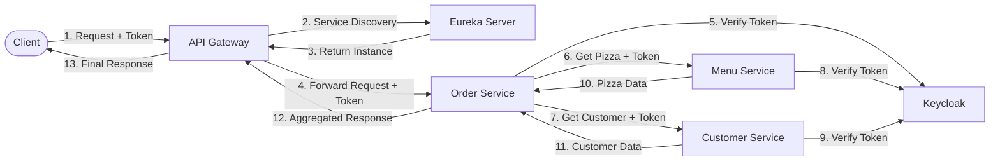
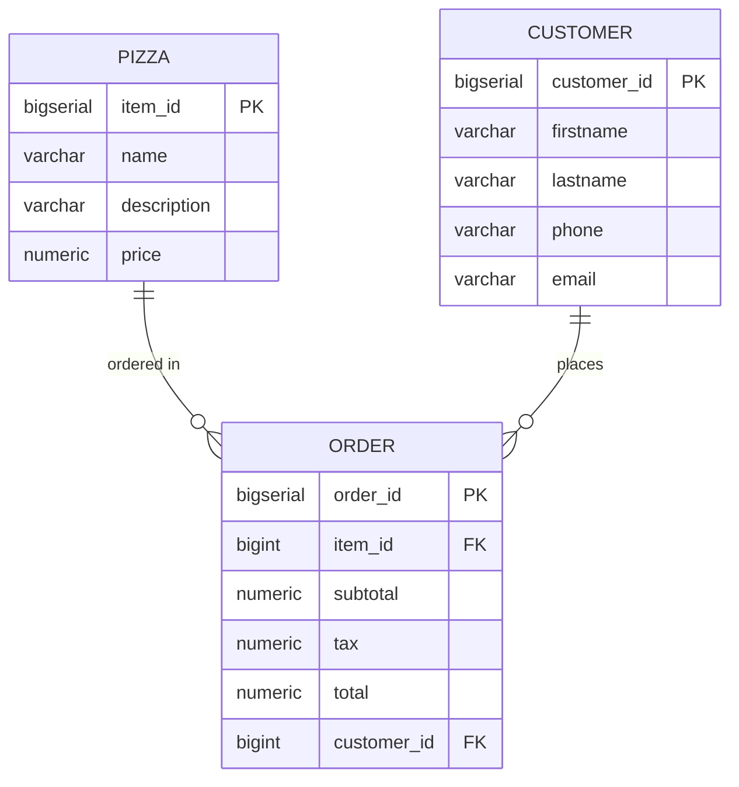

# 🍕 Pizza Store Microservices

A Spring Boot microservices application for managing a pizza store, featuring three independent microservices with centralized configuration and Docker deployment.

## Project Overview

This project demonstrates a microservices architecture for a pizza store management system with the following services:
- **Menu Service**: Manages pizza menu items
- **Order Service**: Manages customer orders and orchestrates service calls
- **Customer Service**: Manages customer information

## Architecture

### System Components

- **API Gateway** (Port 8073): Entry point for all client requests, handles routing and token relay
- **Eureka Server** (Port 8072): Service discovery and registration
- **Keycloak** (Port 8080): Authentication and authorization server
- **Config Server** (Port 8071): Centralized configuration management
- **Menu Service**: Manages pizza menu items (only accessible via gateway)
- **Order Service**: Manages customer orders and orchestrates calls to menu and customer services (only accessible via gateway)
- **Customer Service**: Manages customer information (only accessible via gateway)
- **PostgreSQL Database** (Port 5432): Shared database with separate tables per service

### Request Flow

The following diagram shows how a typical request flows through the system:



**Key Features:**
- **Centralized API Gateway**: Single entry point acting as a Policy Enforcement Point (PEP) for authentication, routing, and request filtering
- **Service Discovery**: Eureka enables dynamic service location
- **Auth Token Propagation**: Auth token flows through all services via `FeignClientInterceptor`
- **Token Validation**: Each service independently validates tokens with Keycloak
- **Resilience**: Circuit breakers, retries, and bulkheads protect inter-service calls

### Canonical Model

The system is divided into three bounded contexts:

1. **Menu Context**: Pizza entity (item_id, name, description, price)
2. **Order Context**: Order entity (order_id, item_id, subtotal, tax, total, customer_id)
3. **Customer Context**: Customer entity (customer_id, firstname, lastname, phone, email)

#### Current State (Simple Model)

The current implementation uses a simplified model focused on core functionality:

**Canonical Model (Simple)**


**Bounded Context (Simple)**


This simplified model demonstrates:
- Clear separation of concerns across three microservices
- Minimal entities per bounded context
- Focus on essential pizza store operations

#### Future State (Expanded Model)

The system can be expanded to include additional entities and relationships:

**Canonical Model (Expanded)**


**Bounded Context (Expanded)**


Potential expansions include:
- **Menu Context**: Add Ingredient entity for pizza composition tracking
- **Order Context**: Add Payment entity for payment processing
- **Customer Context**: Add Address entity for delivery management

This expansion demonstrates how the microservices architecture supports growth while maintaining bounded context isolation.

### Technology Stack

- Java 11
- Spring Boot 2.5.4
- Spring Cloud 2020.0.4
  - Spring Cloud Config
  - Spring Cloud Gateway
  - Spring Cloud Netflix Eureka
  - Spring Cloud OpenFeign
- Spring Security + Keycloak Adapter
- Resilience4j (Circuit Breaker, Retry, Bulkhead, Time Limiter)
- Spring Data JPA
- PostgreSQL
- Keycloak 15.0.2
- Docker & Docker Compose
- Lombok
- Maven

## Prerequisites

- Java 11 or higher
- Maven 3.6+
- Docker and Docker Compose
- Postman (for API testing)

## Project Structure

```
pizza-store/
├── config-server/          # Centralized configuration service
├── gateway-server/         # API Gateway service
├── eureka-server/          # Service discovery server
├── menu-service/           # Menu/Pizza management microservice
├── order-service/          # Order management microservice
├── customer-service/       # Customer management microservice
├── database/               # SQL initialization scripts
├── keycloak/               # Keycloak realm configuration
├── postman/                # Postman collection for API testing
├── docs/                   # Documentation and architecture diagrams
├── docker-compose.yml      # Docker compose configuration
└── pom.xml                 # Parent POM
```

## Building the Project

### 1. Build All Services

From the project root directory:

```bash
mvn clean package -DskipTests
```

This will build all microservices and create JAR files in their respective `target/` directories.

### 2. Build Individual Services

To build a specific service:

```bash
cd menu-service
mvn clean package -DskipTests
```

Repeat for `order-service`, `customer-service`, and `config-server` as needed.

## Running the Application

### Using Docker Compose

1. **Start all services:**

```bash
docker-compose up --build
```

This will:
- Start PostgreSQL database and initialize tables with sample data
- Start Keycloak authentication server with pre-configured realm
- Start Eureka Server for service discovery
- Start Config Server for centralized configuration
- Start API Gateway for request routing
- Start all three microservices (Menu, Order, Customer)

2. **Stop all services:**

```bash
docker-compose down
```

3. **Stop and remove volumes (clears database and Keycloak data):**

```bash
docker-compose down -v
```

### Service Startup Order

Services start in the following order with health checks:
1. PostgreSQL Database
2. Keycloak Authentication Server
3. Config Server
4. Eureka Server
5. API Gateway
6. Microservices (Menu, Order, Customer)

## Authentication with Keycloak

All API endpoints require a valid JWT token from Keycloak.

### Keycloak Access

- **URL**: http://localhost:8080/auth
- **Admin Console**: http://localhost:8080/auth/admin
- **Admin Credentials**: admin / admin
- **Realm**: pizza-store
- **Client**: pizza-store-client

### Getting an Access Token

Use the Client Credentials grant flow to obtain a token:

```bash
curl -X POST 'http://localhost:8080/auth/realms/pizza-store/protocol/openid-connect/token' \
  -H 'Content-Type: application/x-www-form-urlencoded' \
  -d 'grant_type=client_credentials' \
  -d 'client_id=pizza-store-client' \
  -d 'client_secret=4b1b5a01-9627-47cc-91fe-74bf42cc35c6'
```

Response:
```json
{
  "access_token": "eyJhbGciOiJSUzI1NiIsInR5cCI...",
  "expires_in": 300,
  "token_type": "Bearer"
}
```

### Making Authenticated Requests

All requests must include the Bearer token in the Authorization header:

```bash
curl -X GET 'http://localhost:8073/order-service/api/orders/1' \
  -H 'Authorization: Bearer YOUR_ACCESS_TOKEN'
```

**Note**: All requests should go through the API Gateway (port 8073), not directly to microservices.

## Configuration Profiles

The application supports two profiles:

### Development Profile (dev)
- Database: PostgreSQL on `localhost:5432`
- SQL logging enabled
- Formatted SQL output
- Username/Password: postgres/postgres

### Production Profile (prod)
- Database: PostgreSQL on `localhost:5432`
- SQL logging disabled
- Encrypted password using Spring Cloud Config encryption

To switch profiles, set the `SPRING_PROFILES_ACTIVE` environment variable:

```bash
export SPRING_PROFILES_ACTIVE=prod
```

Or in docker-compose.yml:
```yaml
environment:
  SPRING_PROFILES_ACTIVE: prod
```

## API Endpoints

**Important**: All requests must include a valid JWT Bearer token in the `Authorization` header and should be routed through the API Gateway at `http://localhost:8073`.

### API Gateway Routes

The gateway automatically routes requests based on the service name prefix:

- **Menu Service**: `http://localhost:8073/menu-service/*`
- **Order Service**: `http://localhost:8073/order-service/*`
- **Customer Service**: `http://localhost:8073/customer-service/*`

### Menu Service

- `GET /menu-service/api/pizzas` - Get all pizzas
- `GET /menu-service/api/pizzas/{id}` - Get pizza by ID
- `POST /menu-service/api/pizzas` - Create new pizza
- `PUT /menu-service/api/pizzas/{id}` - Update pizza
- `DELETE /menu-service/api/pizzas/{id}` - Delete pizza

### Order Service

- `GET /order-service/api/orders` - Get all orders
- `GET /order-service/api/orders/{id}` - Get order by ID (includes pizza and customer details)
- `GET /order-service/api/orders/customer/{customerId}` - Get orders by customer
- `POST /order-service/api/orders` - Create new order
- `PUT /order-service/api/orders/{id}` - Update order
- `DELETE /order-service/api/orders/{id}` - Delete order

### Customer Service

- `GET /customer-service/api/customers` - Get all customers
- `GET /customer-service/api/customers/{id}` - Get customer by ID
- `GET /customer-service/api/customers/email/{email}` - Get customer by email
- `POST /customer-service/api/customers` - Create new customer
- `PUT /customer-service/api/customers/{id}` - Update customer
- `DELETE /customer-service/api/customers/{id}` - Delete customer

### Admin Endpoints (No Authentication Required)

- **Eureka Dashboard**: `http://localhost:8072` - View registered services
- **Config Server**: `http://localhost:8071/{service-name}/{profile}` - View service configuration
  - Example: `http://localhost:8071/menu-service/dev`

## Database Schema



**Table Details:**

- **Pizza**: Stores menu items (item_id, name, description, price)
- **Customer**: Stores customer information (customer_id, firstname, lastname, phone, email)
- **Order**: Links customers to pizzas with order details (order_id, item_id, subtotal, tax, total, customer_id)

## Sample Data

The database is initialized with sample data:

- **8 Pizzas**: Margherita, Pepperoni, Hawaiian, BBQ Chicken, Veggie Supreme, Meat Lovers, Four Cheese, Buffalo Chicken
- **5 Customers**: John Doe, Jane Smith, Mike Johnson, Sarah Williams, David Brown
- **5 Orders**: Sample orders linking customers to pizzas

## Resilience Patterns

The application implements several resilience patterns using Resilience4j to protect inter-service communication:

### Circuit Breaker

Prevents cascading failures by opening the circuit when a service is down:

- **Failure Rate Threshold**: 50% (circuit opens after 50% of calls fail)
- **Wait Duration in Open State**: 10 seconds
- **Sliding Window**: 5 calls to calculate failure rate
- **Minimum Calls**: 3 calls before circuit breaker activates

### Retry

Automatically retries failed calls:

- **Max Attempts**: 3 attempts per call
- **Wait Duration**: 2 seconds between retries
- **Exponential Backoff**: Enabled

### Bulkhead

Limits concurrent calls to prevent resource exhaustion:

- **Max Concurrent Calls**: 10 per service
- **Max Wait Duration**: 0ms (fail immediately if bulkhead is full)

### Time Limiter

Prevents slow calls from blocking threads:

- **Timeout Duration**: 5 seconds
- **Cancel Running Future**: true (cancels the call if timeout is reached)

### Fallback Methods

When a service is unavailable, fallback methods provide default responses:

- **Menu Service**: Returns "Pizza (Details Unavailable)" with zero price
- **Customer Service**: Returns "Customer (Details Unavailable)" with empty contact info

**Example**: When fetching order details, if the menu-service is down, the order service will still return the order with default pizza information.

## Development Notes
- Each microservice is a minimal CRUD service primarily meant for demonstration purpose — responsibilities can be expanded as microservices evolve
- Each microservice has its own 3-layer architecture: Controller → Service → Repository
- Service Discovery: Services register with Eureka and discover each other dynamically
- Inter-Service Communication: Uses Feign clients with automatic JWT token propagation via `FeignClientInterceptor`
- Separation of Concerns: External service calls are isolated in dedicated client services (`MenuServiceClient`, `CustomerServiceClient`) to enable proper AOP interception of Resilience4j annotations
- JPA/Hibernate with `validate` mode (expects tables to exist)
- RESTful endpoints follow standard conventions
- Proper HTTP status codes (200 OK, 201 Created, 204 No Content, 404 Not Found)
- Comprehensive logging for debugging resilience patterns and authentication flows

