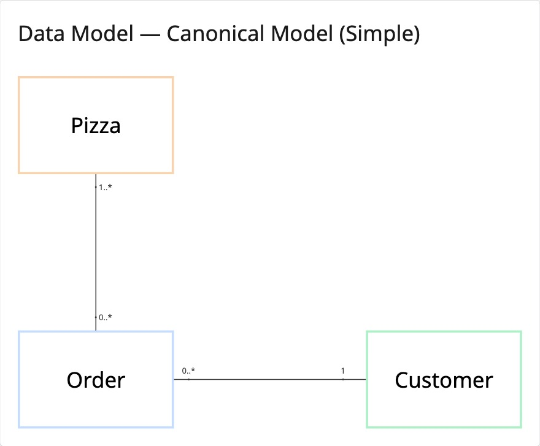
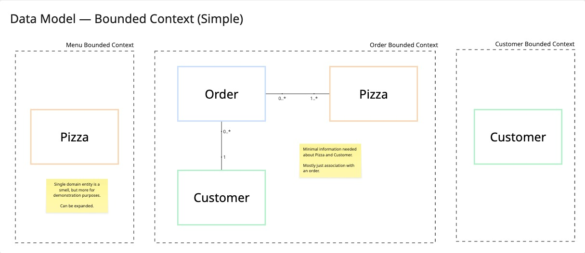
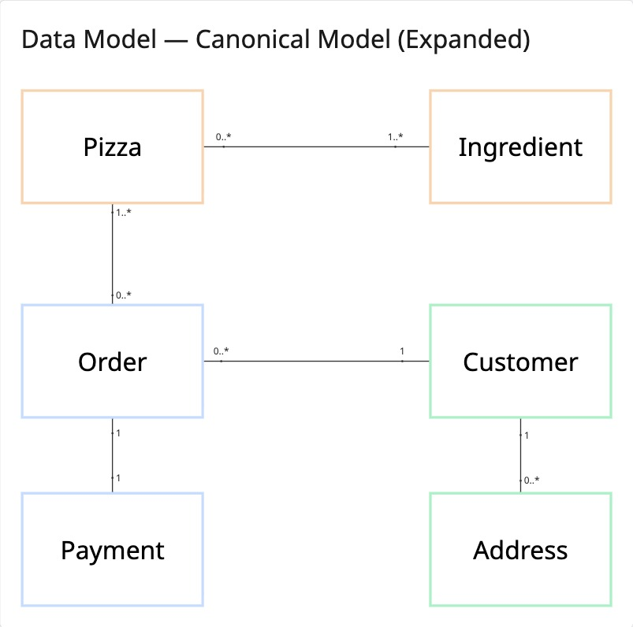
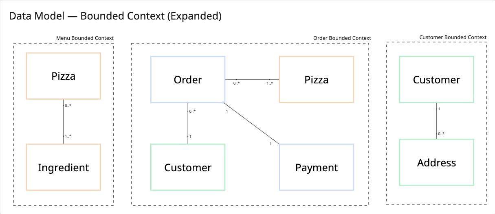
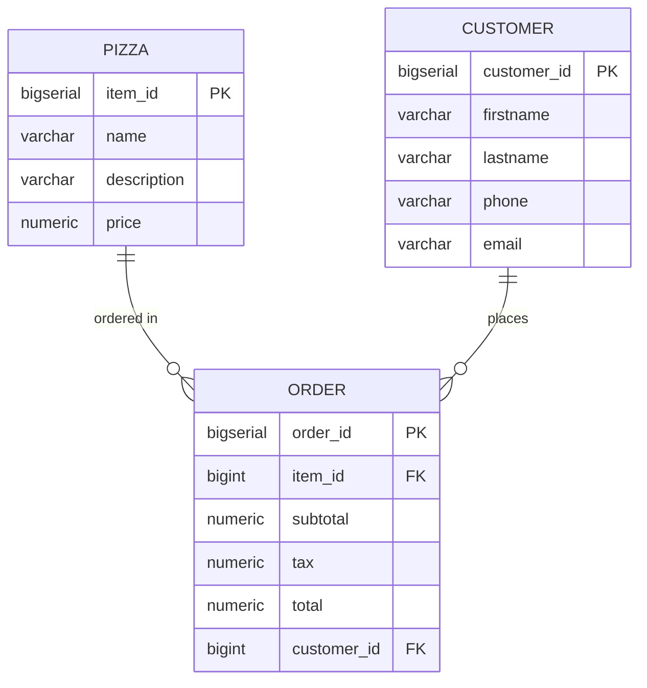

# 🍕 Pizza Store Microservices

A Spring Boot microservices application for managing a pizza store, featuring three independent microservices with centralized configuration and Docker deployment.

## Project Overview

This project demonstrates a microservices architecture for a pizza store management system with the following components:

- **Menu Service** (Port 8081): Manages pizza menu items
- **Order Service** (Port 8082): Manages customer orders
- **Customer Service** (Port 8083): Manages customer information
- **Config Server** (Port 8071): Centralized configuration management
- **PostgreSQL Database** (Port 5432): Shared database with separate tables per service

## Architecture

### Canonical Model

The system is divided into three bounded contexts:

1. **Menu Context**: Pizza entity (item_id, name, description, price)
2. **Order Context**: Order entity (order_id, item_id, subtotal, tax, total, customer_id)
3. **Customer Context**: Customer entity (customer_id, firstname, lastname, phone, email)

#### Current State (Simple Model)

The current implementation uses a simplified model focused on core functionality:

**Canonical Model (Simple)**



**Bounded Context (Simple)**



This simplified model demonstrates:
- Clear separation of concerns across three microservices
- Minimal entities per bounded context
- Focus on essential pizza store operations

#### Future State (Expanded Model)

The system can be expanded to include additional entities and relationships:

**Canonical Model (Expanded)**



**Bounded Context (Expanded)**



Potential expansions include:
- **Menu Context**: Add Ingredient entity for pizza composition tracking
- **Order Context**: Add Payment entity for payment processing
- **Customer Context**: Add Address entity for delivery management

This expansion demonstrates how the microservices architecture supports growth while maintaining bounded context isolation.

### Technology Stack

- Java 11
- Spring Boot 2.5.4
- Spring Cloud Config 2020.0.4
- Spring Data JPA
- PostgreSQL
- Docker & Docker Compose
- Lombok
- Maven

## Prerequisites

- Java 11 or higher
- Maven 3.6+
- Docker and Docker Compose
- Postman (for API testing)

## Project Structure

```
pizza-store/
├── config-server/          # Centralized configuration service
├── menu-service/           # Menu/Pizza management microservice
├── order-service/          # Order management microservice
├── customer-service/       # Customer management microservice
├── database/               # SQL initialization scripts
├── postman/                # Postman collection for API testing
├── docker-compose.yml      # Docker compose configuration
└── pom.xml                 # Parent POM
```

## Building the Project

### 1. Build All Services

From the project root directory:

```bash
mvn clean package -DskipTests
```

This will build all microservices and create JAR files in their respective `target/` directories.

### 2. Build Individual Services

To build a specific service:

```bash
cd menu-service
mvn clean package -DskipTests
```

Repeat for `order-service`, `customer-service`, and `config-server` as needed.

## Running the Application

### Using Docker Compose

1. **Start all services:**

```bash
docker-compose up --build
```

This will:
- Start PostgreSQL database and initialize tables with sample data
- Start the Config Server
- Start all three microservices (Menu, Order, Customer)

2. **Stop all services:**

```bash
docker-compose down
```

## Configuration Profiles

The application supports two profiles:

### Development Profile (dev)
- Database: PostgreSQL on `localhost:5432`
- SQL logging enabled
- Formatted SQL output
- Username/Password: postgres/postgres

### Production Profile (prod)
- Database: PostgreSQL on `localhost:5432`
- SQL logging disabled
- Encrypted password using Spring Cloud Config encryption

To switch profiles, set the `SPRING_PROFILES_ACTIVE` environment variable:

```bash
export SPRING_PROFILES_ACTIVE=prod
```

Or in docker-compose.yml:
```yaml
environment:
  SPRING_PROFILES_ACTIVE: prod
```

## API Endpoints

### Menu Service (localhost:8081)

- `GET /api/pizzas` - Get all pizzas
- `GET /api/pizzas/{id}` - Get pizza by ID
- `POST /api/pizzas` - Create new pizza
- `PUT /api/pizzas/{id}` - Update pizza
- `DELETE /api/pizzas/{id}` - Delete pizza

### Order Service (localhost:8082)

- `GET /api/orders` - Get all orders
- `GET /api/orders/{id}` - Get order by ID
- `GET /api/orders/customer/{customerId}` - Get orders by customer
- `POST /api/orders` - Create new order
- `PUT /api/orders/{id}` - Update order
- `DELETE /api/orders/{id}` - Delete order

### Customer Service (localhost:8083)

- `GET /api/customers` - Get all customers
- `GET /api/customers/{id}` - Get customer by ID
- `GET /api/customers/email/{email}` - Get customer by email
- `POST /api/customers` - Create new customer
- `PUT /api/customers/{id}` - Update customer
- `DELETE /api/customers/{id}` - Delete customer

### Config Server (localhost:8071)

- `GET /{service-name}/{profile}` - Get configuration for a service
  - Example: `http://localhost:8071/menu-service/dev`

## Database Schema



**Table Details:**

- **Pizza**: Stores menu items (item_id, name, description, price)
- **Customer**: Stores customer information (customer_id, firstname, lastname, phone, email)
- **Order**: Links customers to pizzas with order details (order_id, item_id, subtotal, tax, total, customer_id)

## Sample Data

The database is initialized with sample data:

- **8 Pizzas**: Margherita, Pepperoni, Hawaiian, BBQ Chicken, Veggie Supreme, Meat Lovers, Four Cheese, Buffalo Chicken
- **5 Customers**: John Doe, Jane Smith, Mike Johnson, Sarah Williams, David Brown
- **5 Orders**: Sample orders linking customers to pizzas

## Development Notes
- Each microservice is a minimal CRUD service primarily meant for demonstration purpose — responsibilites can be expanded as microservices evolve
- Each microservice has its own 3-layer architecture: Controller → Service → Repository
- JPA/Hibernate with `validate` mode (expects tables to exist)
- RESTful endpoints follow standard conventions
- Proper HTTP status codes (200 OK, 201 Created, 204 No Content, 404 Not Found)

